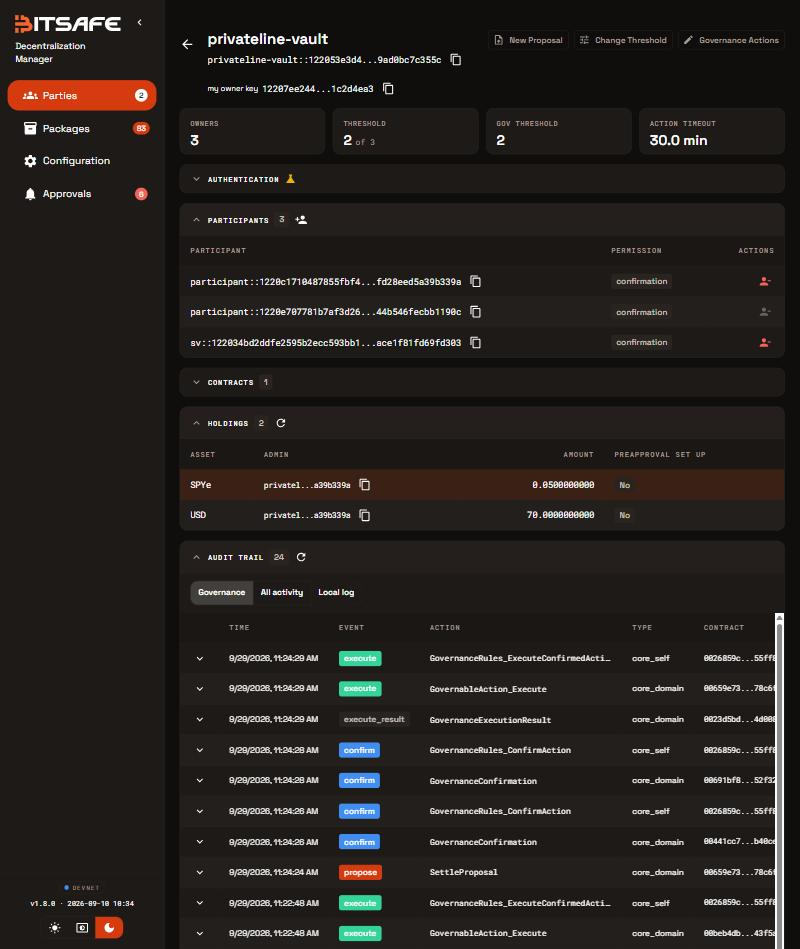
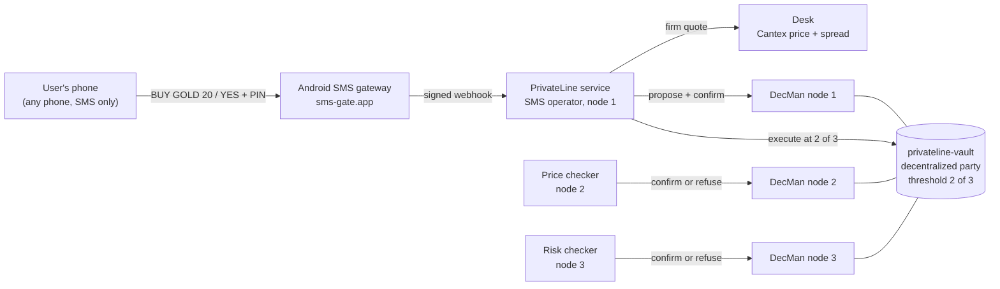

# PrivateLine

**Stocks and gold by text message, private on Canton.**

Text `BUY GOLD 20` from any phone: no app, no mobile data, no gas. PrivateLine restates the order,
you reply `YES` and your PIN, and the trade runs on Canton. Your holdings are visible only to you
and the vault, and the vault is a decentralized party run by three independent operators: **every
trade needs 2 of the 3**, so no single company can move your money.

**Try it live: https://privateline.pages.dev/try.** It's a phone simulator in the browser that
needs no real phone. It runs on BitSafe's Decentralization Manager LocalNet, on a small server,
with demo dollars only. Cloudflare Pages forwards requests to that server
([deploy/README.md](deploy/README.md)).

Built for HackCanton Season 3: Financial Applications track and BitSafe's "Decentralizing Apps on
Canton" challenge. Launch market for the pitch: Nigeria, where most people have a phone but many
don't have a smartphone data plan, and where dollar assets like the S&P 500 and gold are hard to
reach.



*BitSafe's Decentralization Manager dashboard for the vault:*

- *3 owners, with a threshold of 2 of 3;*
- *the vault's pooled demo tokens;*
- *an audit trail of each PrivateLine action with its confirmations.*

## What it does

| You text | PrivateLine replies |
|---|---|
| `BAL` | `Cash $75.00 \| S&P 500 0.00651 share ($4.98) \| Gold 0.00483 oz ($19.97) \| Total $99.95. Acct pl-2de7` |
| `PRICE GOLD` | `Gold on Canton: buy $4,145.59, sell $4,112.56 per oz. Market price $4,183.30 (Canton -1.3%).` |
| `BUY GOLD 20` | `Buy $20.00 of Gold at about $4,145.59/oz (0.00482 oz)? Reply YES and your PIN within 2 min to confirm, NO to cancel. Ref TEA5E` |
| `YES 4829` | `Done: bought 0.00482 oz Gold for $20.00 at $4,145.59/oz. Cash $80.00. Ref TEA5E` |
| `SELL GOLD ALL` | *(after YES + PIN, with Cantex's gold price 1.69% under the market)* `Not done: Gold costs 1.69% less on Canton than on the market right now, so our independent price checkers refused it. No money moved.` |
| `ALERT BTC 1` | Later: `PrivateLine alert: Bitcoin is up 2.0% to $83,395/BTC since $81,727.` |
| `DEPOSIT` | `To add money, send naira to PrivateLine Demo Bank, account 9981131079 (PrivateLine pl-a855), from your bank app or USSD. Rate: N1,347 = $1. We'll text you when it lands.` |
| *(N15,000 arrives)* | `Received N15,000 = $11.13 at N1,347/$. Cash $111.13. Text BUY GOLD 10 to invest.` |
| `WITHDRAW 5` | `Withdraw $5.00 = N6,536 (N1,307/$) to GTBank ****9954 (ADA OKAFOR)? Reply YES and your PIN within 2 min, NO to cancel. Ref W9FE9` |
| `LOCK` | Freezes the account until you unlock it on the website with your email. |

Assets: S&P 500 (SPYe), Nasdaq 100 (QQQe), gold (eXAU), silver (eXAG), bitcoin (cBTC) and ether
(cETH). These tokens trade on Canton MainNet today, on Cantex. Amounts are in US dollars, and
fractions are fine.

## How a trade is approved

1. The **SMS operator** (node 1) reads your text and checks your PIN. Three wrong PINs pause
   trading for 15 minutes.
2. It asks the **desk** for a firm quote (Cantex price plus a 0.4% spread, valid for a minute) and
   proposes the trade on the ledger. The proposal is a Daml contract implementing BitSafe's
   `GovernableAction`. The operator's own confirmation counts as 1 of 3.
3. The **price checker** (node 2) and the **risk checker** (node 3) each check the proposal on
   their own ledger node, against their own fetch of the real-world price (Yahoo Finance). Each
   one refuses if:
   - the price is more than 1.5% worse for you than the market;
   - the quote expired;
   - it breaks your daily or per-trade limit;
   - you don't hold enough.

   A checker then either confirms through its DecMan node, or records a `CheckRefusal` with the
   reason on the ledger.
4. With 2 of 3 confirmations, the operator executes through `GovernanceRules_ExecuteConfirmedAction`.
   The contract checks everything again at execution: quote validity, your confirmed price limit,
   your balance and your daily limit. Your account, the desk's fill and an audit record change
   together, in one transaction.

On LocalNet this takes about 4 to 6 seconds.

- **If one checker's node is offline,** the other completes the approval.
- **If both are offline, or both refuse,** nothing moves.



## Who can see what

| Party | Sees |
|---|---|
| You | Your account contract: your balances, under your own Canton party. |
| Any other user | Nothing: not your account, trades, fills or approvals. |
| The desk | Fills with a size and a reference, never a user or an account. Plus the vault's pooled totals. |
| The 3 operators | Accounts by ID, with a keyed phone tag (never the number), because they check limits and prices. |
| The public, other validators | Nothing. The contracts are only shared with the parties named on them. |
| PrivateLine's database (off-ledger) | Email, the phone number (AES-256-GCM encrypted), a keyed lookup hash, a salted scrypt PIN hash. |

The `/privacy` page shows this **live for your account**. It runs the same ledger queries as each
of these parties and shows what comes back.

What this does not hide:

- **SMS itself is not encrypted.** The mobile network and the SMS gateway can read your texts,
  just as they can read bank SMS alerts.
- **The operators see every account,** by ID.

### Why pooled tokens plus private accounts

A token's issuer signs every holding of that token. If each user held their own tokens, the issuer
would see every user's position. Instead:

- the vault holds pooled CIP-56 tokens, which BitSafe's dashboard lists as holdings;
- each user's share is a private `Account` contract that only the vault and that user can see;
- the desk settles with the vault in net batches, so it learns only totals and trade sizes.

A second benefit: a user's trade touches only that user's account, so two users trading at once
never conflict.

## Safety

- **2 of 3 operators for every money move:** opening an account, deposits, trades, withdrawals
  and settlements.
- **Withdrawals go only to the bank account that funded the wallet.** A stolen phone can't send
  money anywhere new, and every withdrawal still needs the PIN, both checkers' limits, and 2 of 3.
- **Price integrity.** Both checkers refuse trades priced more than 1.5% against the user compared
  with the real market. This happened live: on 2026-09-29, Cantex's gold bid sat 1.69% under the
  market price, and `SELL GOLD ALL` was refused.
- **PIN confirmation.** Every trade needs the user's PIN within 2 minutes. Three wrong PINs pause
  trading for 15 minutes.
- **On-ledger limits.** The daily trading limit is enforced by the account contract itself.
- **SIM-swap protection.** Moving an account to a new phone works like this:
  - the new phone must prove it gets texts;
  - the old phone is warned and can reply `NO`;
  - a cooldown (24 hours, 2 minutes in the demo) is enforced by the contract, however many
    operators approve early;
  - the risk checker confirms only after the cooldown.
- **`LOCK` by text.** Only the website, reached by email sign-in, unlocks.
- **Stale data fails safely.** A proposal whose account changed underneath it fails at execution.
  It never acts on old balances.

## Adding and withdrawing money

People in Nigeria pay by bank transfer and USSD, so that's how money comes in. Naira is converted
to **dollars**, not to CC or cBTC. Deposits should hold their value until the user chooses an
investment, and a CC transfer is public on the ledger, which a private wallet shouldn't need.

**The demo, live now.** Try it at [/try](https://privateline.pages.dev/try) and
[/bank](https://privateline.pages.dev/bank).

1. Text `DEPOSIT`. PrivateLine replies with a personal deposit account number and today's rate:
   the market rate from open.er-api.com plus a 1.5% exchange spread.
2. Send naira from the **demo bank** page, which stands in for a bank app or a `*737#` USSD code.
   The demo bank sends a signed payment notification to `POST /payments/webhook`. It uses the
   format a Nigerian payment provider sends for a dedicated virtual account (Paystack's
   `charge.success`, signed with HMAC-SHA512).
3. PrivateLine verifies the signature and matches the account number to the user. It then
   proposes a `DepositProposal`, and the dollars are credited once 2 of 3 operators approve.
   About 3 seconds from transfer to text. Each payment reference is credited once, however many
   times the notification arrives. A deposit that fails is retried every minute.
4. `WITHDRAW 5`, then `YES <PIN>`, proposes a `WithdrawProposal`. Both checkers look at the
   amount (up to $500) and the balance. With 2 of 3, the contract:
   - debits the account;
   - burns the vault's dollars with the desk;
   - sends the naira to the bank account the user last deposited from, and to no other account.

**Next milestone: real money on Canton MainNet.** Each demo piece has a real counterpart, and the
webhook already takes the real format:

| Demo | MainNet |
|---|---|
| Demo bank account number per user | A dedicated virtual account per user from a licensed Nigerian payment provider: Paystack, Flutterwave or Monnify. |
| Rate from open.er-api.com | A quote from a licensed exchange. Busha and Quidax hold SEC Nigeria approval-in-principle as digital asset exchanges. It converts naira to USDC; PrivateLine never swaps naira itself. |
| Desk mints demo dollars | Circle's xReserve turns the USDC into **USDCx** on Canton, into the vault. Deposits are credited instantly from a float of USDCx, and the float is refilled in daily batches. |
| Desk burns demo dollars | USDCx back to USDC, back to naira, paid out by the payment provider to the user's own funding account. |

The Daml side doesn't change shape. `DepositProposal` and `WithdrawProposal` already move a
CIP-56 holding in and out of the vault 2 of 3, and USDCx is a CIP-56 token. What's left is
business, not code:

- the payment-provider account and the exchange partnership;
- KYC tiers matched to the provider's limits;
- a funded float.

## Run it

You need:

- Windows with WSL2, or Linux/macOS;
- Docker with 12 GB of memory;
- Node 24;
- the Daml SDK 3.4.11 (`scripts/dev/install-daml-toolchain.sh`).

1. **BitSafe's LocalNet.** In a WSL clone of
   [DLC-link/decentralization-manager](https://github.com/DLC-link/decentralization-manager)
   (branch `hackathon`), run:
   - `./hackathon/up.sh`;
   - `./hackathon/seed.sh` (member parties and governance DARs);
   - then `scripts/dev/localnet-vault.sh` from this repo, which creates `privateline-vault`
     (3 nodes, threshold 2).
2. **Contracts:** `scripts/dev/daml-test.sh` builds the DAR and runs the 21 Daml tests.
3. **App:** from `app/`, run:
   - `npm install`;
   - `npm run localnet:setup`, which distributes the DAR through DecMan (node 1 proposes, nodes 2
     and 3 accept) and creates the desk;
   - `npm start`, which starts the website, the SMS service and both checkers on
     http://localhost:8790.
4. **Try it:** open http://localhost:8790/try, sign up with the page's `+999` demo number, then
   text it. Numbers starting with `+999` (an unassigned country code) go to the simulator, so a
   demo can never text a real person.

Settings are listed in [`app/.env.example`](app/.env.example).

## Demo script (BitSafe's criteria)

| Show | How |
|---|---|
| A trade approved 2 of 3 | Text `BUY GOLD 20`, then `YES <PIN>`. Watch it on http://localhost:8081, under Parties > privateline-vault > Audit trail. |
| One operator can't act alone | `CHECKERS=off npm start`, then trade: after 30 s, "not enough operators approved it in time". |
| One node offline | `docker stop decman-2`, then trade: the risk checker completes it. `docker stop decman-3` too: nothing moves. `docker start decman-2 decman-3`. |
| Refusing an off-market trade (a recorded drift) | `PRICE_MODE=replay npm run demo:approval -- cETH 20` replays Cantex at 2026-09-26 06:38 UTC, when cETH traded 2.34% over ETH. Both checkers refuse, and the refusals are on the ledger. |
| SIM-swap protection | `node scripts/phone-change-demo.ts <email> <old +999> <new +999>` with a 120-second cooldown in `app/.env`. |
| Privacy | `/privacy` while signed in. Also `daml/privateline-test/.../PrivacyTest.daml`. |
| Money in and out | Text `DEPOSIT`, send naira from `/bank`, then `WITHDRAW 5` and `YES <PIN>`. Or run `BASE_URL=<url> node scripts/funding-e2e.ts`. The demo bank statement shows both legs. |
| Books balance | `npm run demo:settle`: after net settlement the vault's tokens equal the sum of all accounts. |

## Real SMS

The service already speaks sms-gate.app's webhook format: HMAC-SHA256 over timestamp plus body,
and either the `sender` or `phoneNumber` field. Its send code is ported from our earlier BinaText
project. PrivateLine runs its own gateway phone with a dedicated SIM. Setup is in
[docs/sms-gateway-setup.md](docs/sms-gateway-setup.md):

1. Install SMS Gateway for Android on the phone.
2. Put its credentials in `app/.env`, and list your own numbers in `REAL_SMS_ALLOW`. Real SMS is
   closed by default: only listed numbers can be texted, so a public demo can never text a stranger.
3. Open a public tunnel to this machine.
4. Run `npm run smsgate -- register`.

On the live server, `deploy/set-smsgate.sh <ip>` does steps 2 to 4 without the credentials ever
touching a file on your laptop.

## Layout

```
daml/privateline/        Daml contracts (package privateline-v0)
  PrivateLine/Account     one private account per user
  PrivateLine/Holding     demo tokens, CIP-56 Holding
  PrivateLine/Desk        quotes, fills, net settlement, demo faucet (mint and burn)
  PrivateLine/Actions     GovernableAction proposals: open account, deposit, trade, settle, change phone, withdraw
  PrivateLine/Checks      CheckRefusal
daml/privateline-test/   21 Daml Script tests (trades, limits, 2 of 3, privacy, settlement, safety, funding)
daml/dars/               BitSafe's governance DARs and the CIP-56 API DARs we build against
app/src/                 service: ledger + DecMan clients, operator, checkers, desk, prices, SMS, web API
app/web/                 website: home, try (phone simulator), demo bank, feedback, sign-up, sign-in, account, privacy
app/test/                46 unit tests (commands, price rules, webhook signatures, crypto, funding, proxy, feedback)
app/scripts/             LocalNet setup and demo scripts
scripts/dev/             Windows/WSL setup helpers
```

## Tests

- **Daml:** `scripts/dev/daml-test.sh` runs 21 tests. They cover:
  - one operator can't act;
  - buy and sell;
  - the daily limit and its reset;
  - expired quotes and worse prices;
  - balance, and the desk can't self-fill;
  - stale accounts;
  - three privacy tests;
  - three settlement tests;
  - phone-change cooldown and checker refusal;
  - deposit then withdraw keeps the books balanced, no withdrawing more than the balance, and the
    desk can't burn the vault's dollars.
- **App:** `npm test` (46 unit tests) and `npm run check` (types).
- **End to end, against a running app:**
  - `npm run e2e` signs up and texts a full conversation;
  - `node scripts/funding-e2e.ts` deposits naira from the demo bank and withdraws back to it;
  - `node scripts/feedback-report.ts` prints what testers said in the anonymous feedback form (`/feedback`).
  - `node scripts/phone-change-demo.ts`.

## Limits

- LocalNet only. Balances are demo dollars and demo mirror tokens: the desk mints and redeems them
  at Cantex prices. On MainNet the desk leg would be a Cantex swap of the real tokens, and deposits
  and withdrawals would be USDCx transfers (see
  [Adding and withdrawing money](#adding-and-withdrawing-money)).
- The bank is a demo: no real naira moves, and the exchange rate is a public reference rate.
- Email delivery is simulated: sign-in codes are shown on screen.
- One pending action per account. That's by design: contract ids are resolved at execution.

## Development environment (Windows 11 + WSL2 + Docker Desktop)

- `C:\Users\<you>\.wslconfig` gives WSL 12 GB (BitSafe's LocalNet needs 12 GB for Docker).
- `scripts/dev/start-docker.ps1` starts Docker Desktop when it crashes on leftover socket files.
- `scripts/dev/fetch-localnet-bundle.sh` and `scripts/dev/fetch-ghcr-images.mjs` download the
  LocalNet bundle and the `canton` / `splice-app` images over parallel connections, for networks
  where GitHub's CDN is throttled per connection.
- **After a WSL restart:**
  - start Docker with `start-docker.ps1`;
  - run `hackathon/up.sh`;
  - if Splice stays unhealthy with "exhausted retries" on its database, run
    `docker restart splice` and run `up.sh` again.

See [JOURNAL.md](JOURNAL.md) for the build log.

## License

[Apache-2.0](LICENSE). The prebuilt DARs in `daml/dars/` come from DLC-Link and Digital Asset under
the same license.
